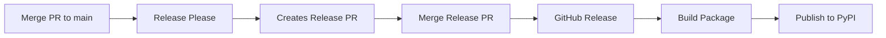

# PyPI Publishing Setup

This guide walks through setting up automated PyPI publishing for the `adcp` package.

## Quick Setup (5 minutes)

### Step 1: Create PyPI Account

If you don't have a PyPI account:

1. Go to https://pypi.org/account/register/
2. Complete registration
3. Verify your email

### Step 2: Generate API Token

1. Log in to PyPI
2. Go to https://pypi.org/manage/account/token/
3. Click **"Add API token"**
4. Fill in:
   - **Token name**: `adcp-github-actions`
   - **Scope**: Select "Entire account" (for first publish)
5. Click **"Add token"**
6. **Copy the token immediately** (starts with `pypi-...`)
   - You can't view it again after closing the dialog!
   - Save it securely

### Step 3: Add Token to GitHub

1. Go to your GitHub repository: https://github.com/YOUR_ORG/adcp-client-python
2. Navigate to **Settings → Secrets and variables → Actions**
3. Click **"New repository secret"**
4. Configure:
   - **Name**: `PYPY_API_TOKEN`
   - **Secret**: Paste your `pypi-...` token
5. Click **"Add secret"**

### Step 4: Done! 🎉

That's it! Now when you merge a Release Please PR, the package will automatically publish to PyPI.

## How It Works

### Automated Publishing Flow



1. **Development**: Make changes using conventional commits
2. **Release Please**: Automatically creates a release PR
3. **Merge Release PR**: Triggers the workflow
4. **Automatic Publishing**:
   - Builds the package (`python -m build`)
   - Publishes to PyPI (`twine upload`)
   - Creates GitHub release

### What Gets Published

The package includes:
- `adcp` module with all source code
- README.md as long description
- LICENSE file
- All dependencies from pyproject.toml

### Version Management

Versions are managed automatically by Release Please:
- `feat:` commits → minor version bump (0.1.0 → 0.2.0)
- `fix:` commits → patch version bump (0.1.0 → 0.1.1)
- `feat!:` or `BREAKING CHANGE:` → major bump (pre-1.0: minor)

## Verification

### Check Package Built Correctly

```bash
# Install build tools
pip install build twine

# Build package
python -m build

# Check with twine
python -m twine check dist/*

# Should see: PASSED ✅
```

### Test Installation After Publishing

```bash
# In a fresh virtual environment
pip install adcp

# Test import
python -c "from adcp import ADCPClient; print('Success!')"
```

### View on PyPI

After first publish, your package will be at:
- https://pypi.org/project/adcp/

## Manual Publishing (Fallback)

If you need to publish manually (not recommended - use Release Please):

```bash
# 1. Update version in pyproject.toml
vim pyproject.toml

# 2. Clean old builds
rm -rf dist/ build/ *.egg-info

# 3. Build
python -m build

# 4. Check
python -m twine check dist/*

# 5. Upload to PyPI
python -m twine upload dist/*
# Enter username: __token__
# Enter password: pypi-... (your API token)
```

## Security Best Practices

### ✅ Do

- Store API token in GitHub Secrets (never in code)
- Use project-scoped tokens after first publish
- Rotate tokens periodically
- Use 2FA on your PyPI account
- Review Release PRs before merging

### ❌ Don't

- Commit tokens to git
- Share tokens in public channels
- Use the same token across multiple projects
- Manually publish if automation works
- Skip reviewing release PRs

## Troubleshooting

### Package name already taken

**Error**: `The name 'adcp' is too similar to an existing project`

**Solution**:
1. Check https://pypi.org/project/adcp/
2. If taken, choose a different name in `pyproject.toml`:
   ```toml
   name = "adcp-client"  # or another unique name
   ```

### Token invalid or expired

**Error**: `Invalid or non-existent authentication information`

**Solution**:
1. Generate new token on PyPI
2. Update `PYPY_API_TOKEN` secret in GitHub
3. Re-run the workflow

### Build fails

**Error**: Package build errors

**Solution**:
```bash
# Test locally first
python -m build

# Check for issues
python -m twine check dist/*

# Review pyproject.toml for errors
```

### First publish requires entire account scope

**Error**: `The user 'TOKEN' isn't allowed to upload to project 'adcp'`

**Why**: Project doesn't exist yet on PyPI

**Solution**: First token must have "Entire account" scope. After first successful publish:
1. Create new token with project scope limited to `adcp`
2. Update `PYPY_API_TOKEN` in GitHub Secrets

## Advanced Configuration

### TestPyPI (Optional)

Test publishing without affecting production:

1. Create TestPyPI account: https://test.pypi.org/
2. Generate token on TestPyPI
3. Add as `TEST_PYPY_API_TOKEN` secret
4. Add workflow step:
   ```yaml
   - name: Publish to TestPyPI
     env:
       TWINE_USERNAME: __token__
       TWINE_PASSWORD: ${{ secrets.TEST_PYPY_API_TOKEN }}
       TWINE_REPOSITORY_URL: https://test.pypi.org/legacy/
     run: twine upload dist/*
   ```

### Custom PyPI Server

For private PyPI server:

```yaml
- name: Publish to private PyPI
  env:
    TWINE_USERNAME: __token__
    TWINE_PASSWORD: ${{ secrets.PRIVATE_PYPI_TOKEN }}
    TWINE_REPOSITORY_URL: https://pypi.yourcompany.com
  run: twine upload dist/*
```

## Monitoring

### Check Release Status

- **Workflow runs**: https://github.com/YOUR_ORG/adcp-client-python/actions
- **Published releases**: https://github.com/YOUR_ORG/adcp-client-python/releases
- **PyPI package**: https://pypi.org/project/adcp/
- **Download stats**: https://pypistats.org/packages/adcp

### Email Notifications

PyPI will email you when:
- New version is published
- Project gets new maintainers
- Security issues are found

## Resources

- [Python Packaging Guide](https://packaging.python.org/)
- [PyPI Help](https://pypi.org/help/)
- [Twine Documentation](https://twine.readthedocs.io/)
- [Release Please](https://github.com/googleapis/release-please)
- [Conventional Commits](https://www.conventionalcommits.org/)

## FAQ

**Q: How do I update package metadata after publishing?**
A: Update `pyproject.toml` and publish a new version. Metadata for old versions can't be changed.

**Q: Can I delete a version after publishing?**
A: You can hide versions, but not delete them. PyPI is immutable by design.

**Q: How do I add co-maintainers?**
A: Go to https://pypi.org/manage/project/adcp/collaboration/ after first publish.

**Q: What if Release Please doesn't create a PR?**
A: Ensure commits use conventional format (`feat:`, `fix:`, etc.)

**Q: How do I publish a pre-release?**
A: Use pre-release version in `pyproject.toml`: `0.1.0a1`, `0.1.0b2`, `0.1.0rc1`

## Current Status

- ✅ Package published to PyPI: https://pypi.org/project/adcp/
- ✅ Latest version: 0.1.2
- ✅ GitHub Actions workflow configured and working
- ✅ `PYPY_API_TOKEN` secret configured with project-scoped token
- ✅ Automated releases working via Release Please

**Installation**: `pip install adcp`
